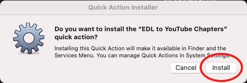
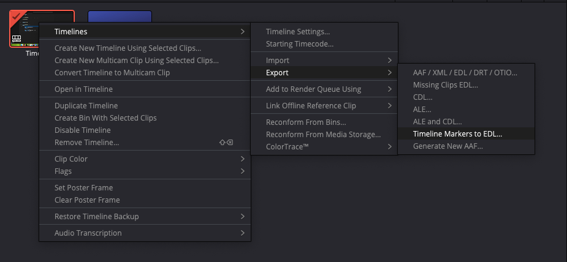
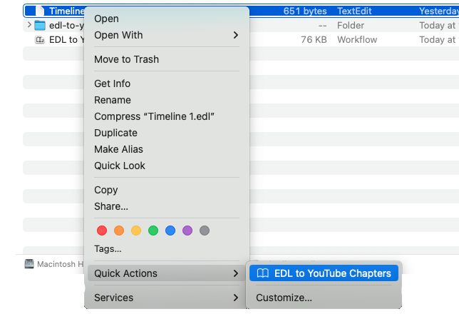
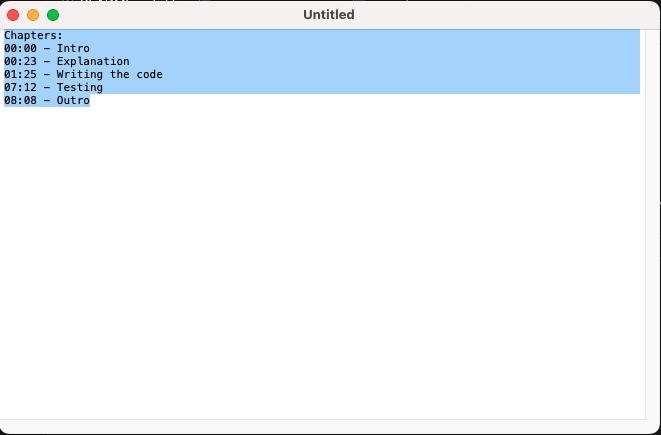

# MacOS EDL to Youtube Chapters
EDL to YouTube Chapters is an automation/quick action I wrote for MacOS that allows DaVinci Resolve markers to be converted to a format that is compatible for YouTube chapter markers.

## Installation
To install the Quick Action, download or clone the repository. Then double-click on "EDL to YouTube Chapters" to install it (NOTE: This workflow isn't signed/notarized by Apple).

## Usage
To use the script, start by exporting your markers from DaVinci Resolve in EDL format (Right-click timeline -> Timelines -> Export -> Timeline Markers to EDL...).

Then find your EDL file in finder. Right-click -> Quick Actions -> EDL to YouTube Chapters.

Once you click that, a new TextEdit document should popup with the YouTube chapters. You can copy the chapters and paste them into your video's description.

## Issues and feature requests 
If you have any issues/feature requests, feel free to open a GitHub issue and I will resolve them as soon as possible!